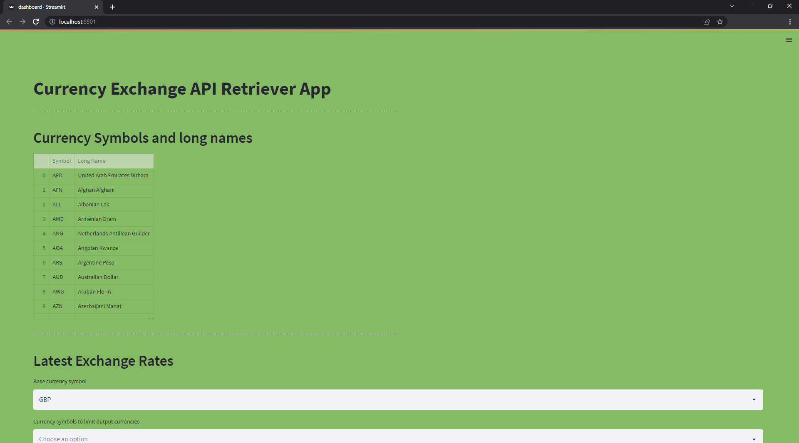
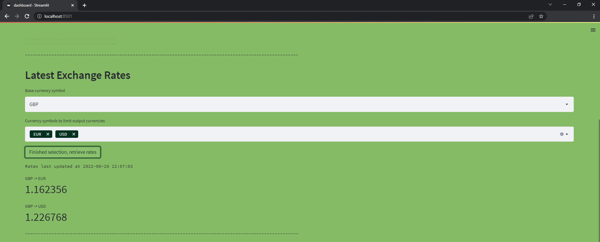
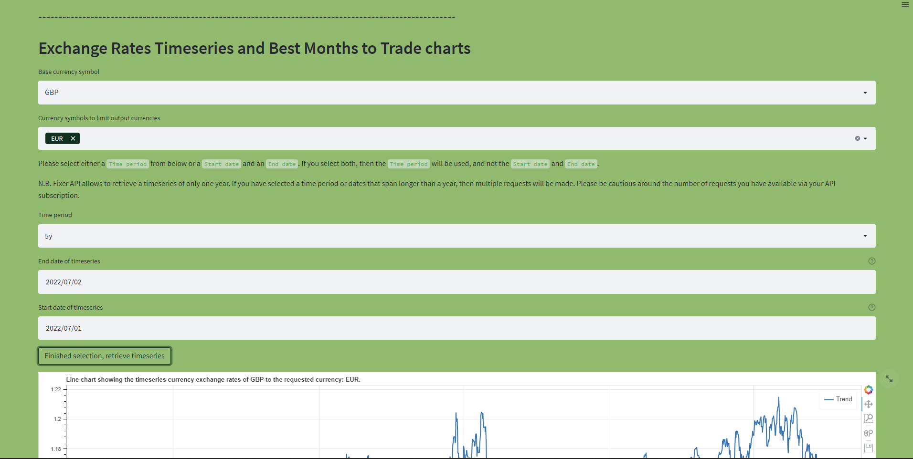
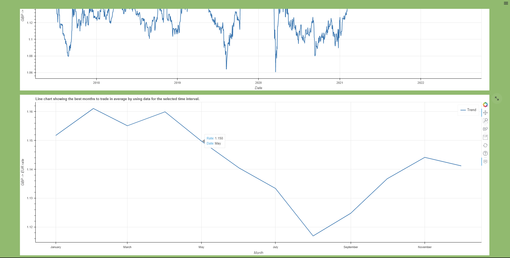

# Currency Exchange API Retriever App

## Description

This python tool aims to retrieve currency exchange data by using Fixer API. Parameters for the requests and data 
display are controlled and implemented by a streamlit dashboard page.

## Fixer API

If you don't have a unique Fixer API key then you can subscribe [here](https://apilayer.com/marketplace/fixer-api)
for a basic plan (no card required) and be able to make up to 100 requests per day for free.

## Installation
```
pip install -r requirements.txt
```

## Configuration

Please place your unique API key as a string value for the `api_key` key of the `configuration.json` file.

## Execution
```
streamlit run dashboard.py
```

## Snapshots








 